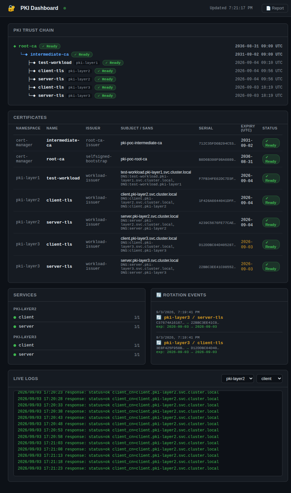
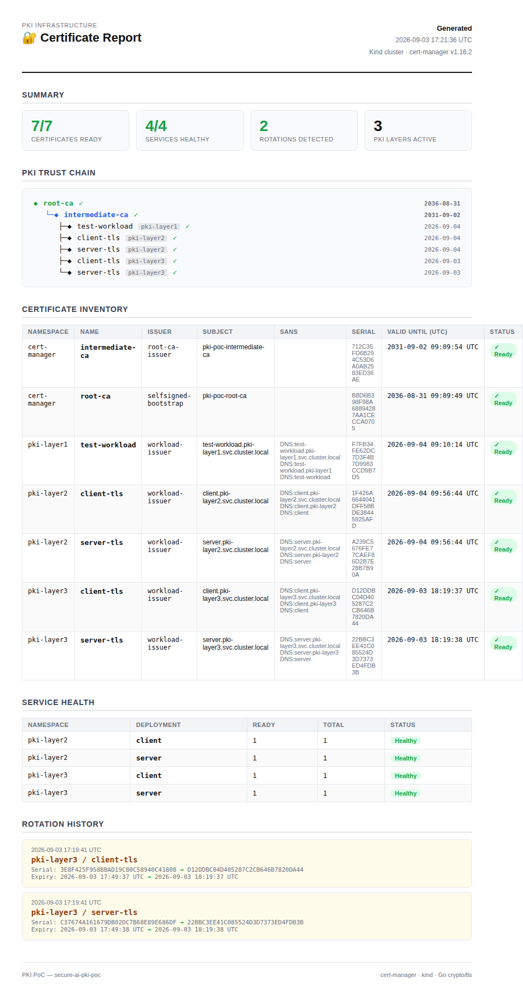

# PKI System for mTLS in Kubernetes

> **Docs:** [README](README.md) · [Development Reference](DEVELOPMENT.md)

A proof-of-concept PKI system on Kubernetes demonstrating how certificates are issued,
enforced, and automatically rotated in a production-style two-tier CA hierarchy.

Built with [cert-manager](https://cert-manager.io/) on a local [kind](https://kind.sigs.k8s.io/)
cluster. The services are written in Go using only the standard library (`crypto/tls`).

---

## Architecture

### CA Hierarchy

```
Root CA  (trust anchor — 10-year lifetime, never issues workload certs)
  └── Intermediate CA  (operational CA — 5-year lifetime)
        ├── test-workload cert   — Layer 1 (certificate issuance)
        ├── server cert          — Layer 2 / 3 (mTLS + rotation)
        └── client cert          — Layer 2 / 3 (mTLS + rotation)
```

The root CA key never signs workload certificates directly. The intermediate CA handles
day-to-day signing, modelling how production PKI protects the root trust anchor.

### Namespaces

| Namespace | Purpose |
|-----------|---------|
| `cert-manager` | cert-manager system + CA secrets |
| `pki-layer1` | Layer 1 — test certificate |
| `pki-layer2` | Layer 2 — mTLS server + client (24h certs) |
| `pki-layer3` | Layer 3 — mTLS server + client (1h certs, auto-rotation) |

### Three Layers

| Layer | Demonstrates |
|-------|-------------|
| **Layer 1** | CA hierarchy setup — cert-manager issues a leaf cert, chain is cryptographically verified |
| **Layer 2** | Mutual TLS — Go server enforces client certs, rejects connections without one |
| **Layer 3** | Automatic rotation — 1h cert lifetime, services hot-reload new certs without restarting |

---

## Key Concepts

| Term | Meaning |
|------|---------|
| **Trust anchor** | The root CA certificate. Anything signed (directly or transitively) by the root is trusted. |
| **Certificate chain** | Root CA → Intermediate CA → leaf cert. Verifying a leaf traces up to the root. |
| **SAN** | Subject Alternative Name — DNS names the TLS client checks against the cert. |
| **mTLS** | Mutual TLS — both sides present certificates. Server rejects clients without a valid cert. |
| **Rotation** | cert-manager renews a cert before expiry and updates the Kubernetes Secret in place. Services pick up the new cert on the next TLS handshake with no restart. |

---

## Prerequisites

| Tool | Version | Install |
|------|---------|---------|
| Docker | ≥ 24 | [docs.docker.com](https://docs.docker.com/get-docker/) |
| kind | ≥ 0.23 | `go install sigs.k8s.io/kind@latest` |
| kubectl | ≥ 1.28 | [kubernetes.io](https://kubernetes.io/docs/tasks/tools/) |
| Helm | ≥ 3.14 | `brew install helm` |
| Go | ≥ 1.22 | [go.dev](https://go.dev/dl/) |
| openssl | any | pre-installed on most systems |

```bash
make install-deps   # installs kind, kubectl, helm (macOS via brew / Linux to ~/.local/bin)
```

---

## Quick Start

```bash
make demo           # full end-to-end: cluster → Layer 1 → 2 → 3 (includes 30-min rotation wait)
make demo-ci        # same but skips the rotation wait (for CI / quick validation)
```

Run individual steps:

```bash
make cluster               # create kind cluster
make install-cert-manager  # install cert-manager via Helm
make deploy-pki            # deploy Root CA + Intermediate CA
make deploy-layer1 && make validate-layer1
make deploy-layer2 && make validate-layer2
make deploy-layer3 && make validate-layer3
```

See `make help` for the full target list.

---

## Dashboards

### `make dashboards` — starts both dashboards with a single Ctrl+C to stop

```bash
make dashboards
```

#### PKI Dashboard — `http://localhost:8080`

Live view of the full PKI state: cert chain tree, all issued certificates with expiry and serial
numbers, deployment health, and rotation events streamed as they happen.



#### PKI Report — `http://localhost:8080/report`

Printable HTML snapshot of the current PKI state — CA hierarchy, full certificate inventory,
service health, and rotation history.



#### Kubernetes Dashboard — `https://localhost:8443`

Standard Kubernetes Dashboard showing all cluster resources including cert-manager
`Certificate` and `ClusterIssuer` CRDs, deployments, secrets, and pods.

```bash
make k8s-dashboard-token   # print a fresh login token
```

---

## Tests

```bash
make test
```

Covers `ReloadableCert` (initial load, manual reload, watch-based hot-reload) and mTLS
handshake correctness (valid client cert accepted, missing cert rejected).

---

## Implementation Details

See [DEVELOPMENT.md](DEVELOPMENT.md) for the full technical reference: service architecture,
hot-reload internals, script design, CI pipeline, and repository layout.
